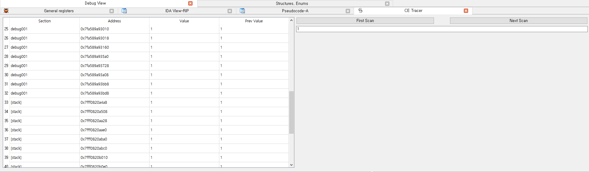
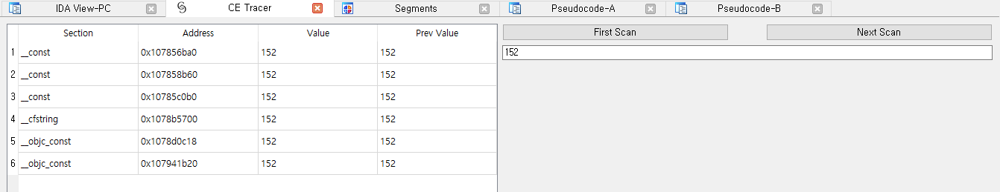

# CE_Tracer-IDA

IDA 버전 CheatEngine Memory Tracer

[eng](README_ENG.md)

---

# Info

IDA 에서 사용할 수 있는 값 추적 플러그인 입니다.

# Installation

`(IDA Pro 폴더)\plugins` 에 **CE_Tracer** 플러그인 폴더와 파일을 위치시킨다.

# Usage

원하는 바이너리를 IDA 로 로드 후, 원격 디버깅 시 `Shift+T` 단축키를 통해 **CE_Tracer** 를 실행 시킨다.

찾고 싶은 값을 입력 하고 `First Scan` 후, 코드 진행 하면서 `Next Scan` 을 실행한다.

# More

버그는 issue 탭에, 추가 문의 사항은 [a42873410@gmail.com](a42873410@gmail.com) 으로 주세요
